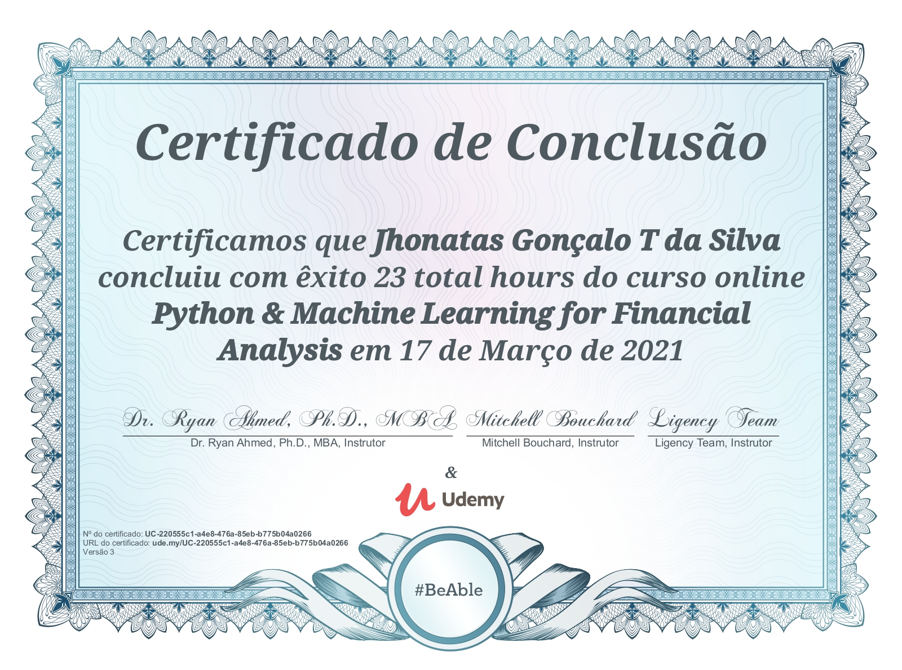

# Python-ML-for-Finance

Python for Financial Analysis, CAPM, Stock Markets Analysis and Visualization, Asset Allocation, Monte Carlo Simulation, Portfolio Optimization, and Trading with Momentum, Bank Market Segmentation

